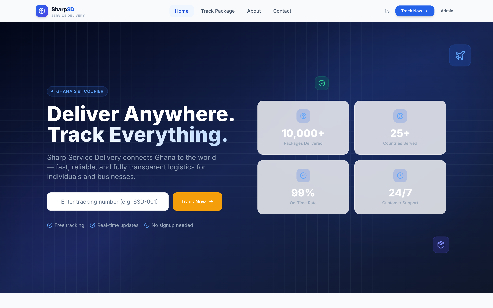
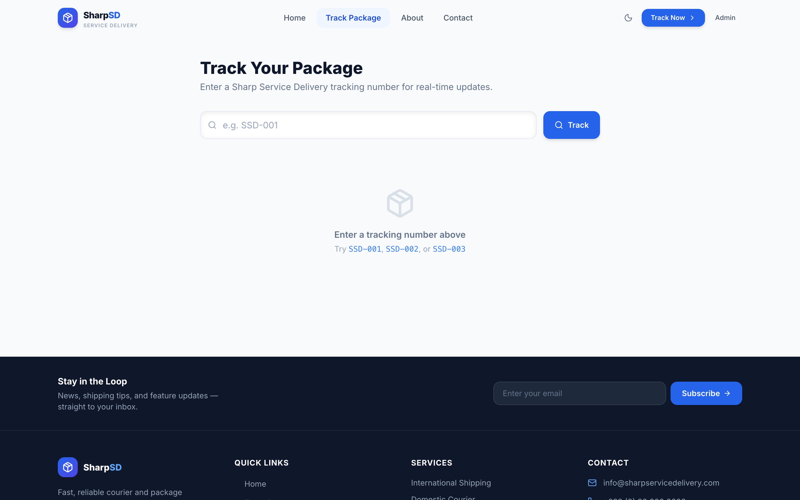
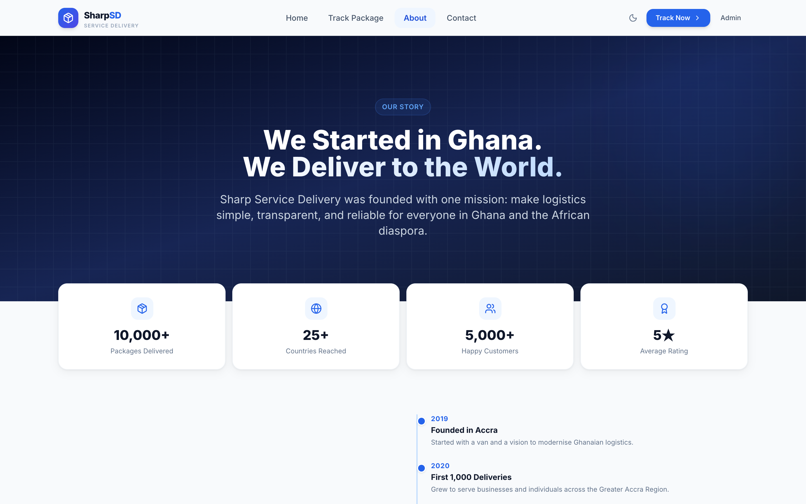
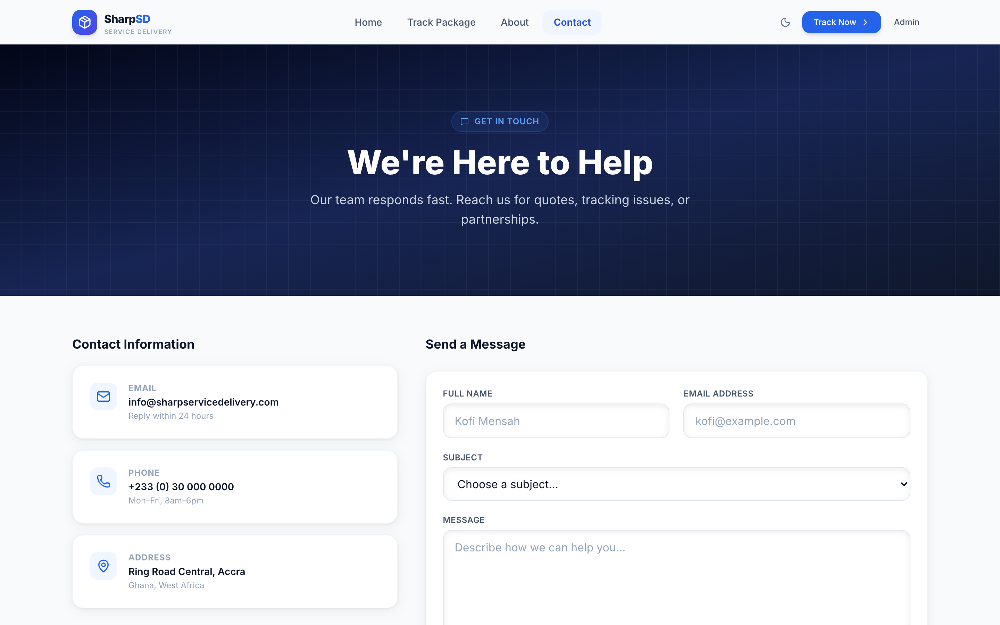
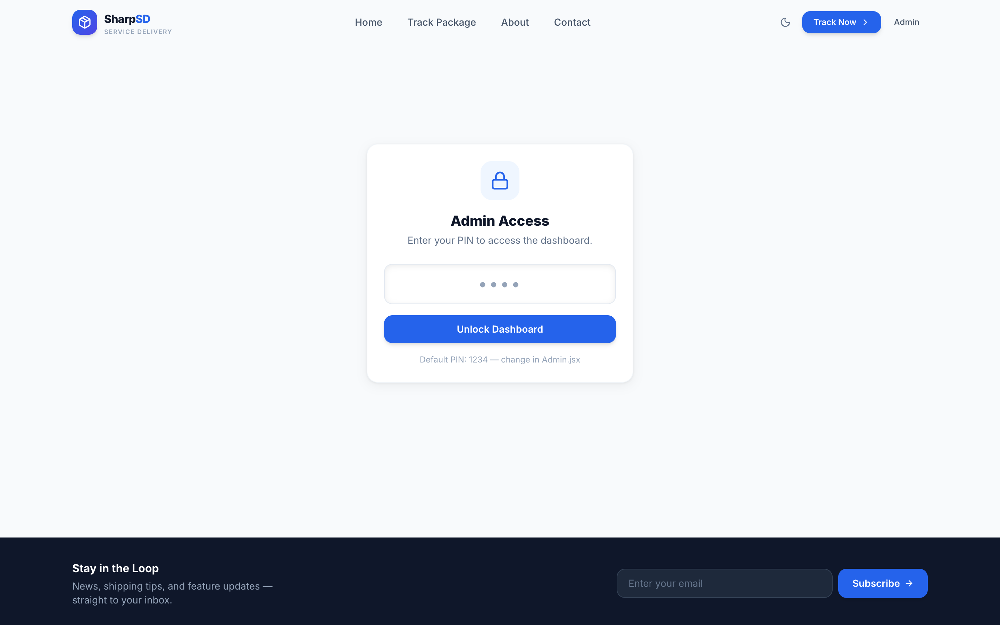

# Sharp Service Delivery

**Fast, reliable, and fully transparent logistics — connecting Ghana to the world.**

A modern courier and package tracking web application built with React + Vite. Features real-time shipment tracking, an admin dashboard with analytics, dark mode, smooth animations, and a fully responsive mobile-first design.

---

## Screenshots

### Home


### Track a Package


### About Us


### Contact


### Admin Dashboard


---

## Features

- **Live package tracking** — search by tracking ID, animated step-by-step timeline, copy-to-clipboard
- **Admin dashboard** — PIN-protected, full CRUD, bar & pie charts (Recharts), sortable table, CSV export
- **Animated UI** — page transitions, hero animations, scroll-triggered fade-ups (Framer Motion)
- **Skeleton loading** — shimmer placeholders while data loads
- **Dark mode** — auto-detects system preference, toggle in navbar
- **Real-time form validation** — inline errors on the Contact page
- **FAQ accordion** — animated expand/collapse
- **Newsletter subscription** — footer opt-in with toast confirmation
- **Mobile-first** — responsive across all breakpoints, slide-in mobile drawer

---

## Tech Stack

| Layer | Technology |
|---|---|
| Framework | React 18 + Vite 6 |
| Routing | React Router v6 |
| Styling | Tailwind CSS v3 |
| Animations | Framer Motion |
| Icons | Lucide React |
| Charts | Recharts |
| Notifications | react-hot-toast |
| Data layer | localStorage (API-ready) |

---

## Getting Started

### Prerequisites
- Node.js 18+
- npm 9+

### Install & run

```bash
# Clone the repo
git clone https://github.com/fredopoku/Sharp-Service-Delivery-web-App.git
cd Sharp-Service-Delivery-web-App

# Install dependencies
npm install

# Start development server
npm run dev
```

Open [http://localhost:5173](http://localhost:5173) in your browser.

### Build for production

```bash
npm run build
npm run preview
```

---

## Pages

| Route | Description |
|---|---|
| `/` | Home — hero, stats, services, how-it-works, testimonials |
| `/track` | Track a package by ID with live timeline |
| `/about` | Company story, milestones, values, team |
| `/contact` | Contact form with validation + FAQ accordion |
| `/admin` | PIN-protected admin dashboard |

---

## Demo Tracking Numbers

Use these on the `/track` page to see the full tracking experience:

| ID | Status |
|---|---|
| `SSD-001` | In Transit — Kumasi → London |
| `SSD-002` | Delivered — Accra → Toronto |
| `SSD-003` | Pending Pickup — Takoradi → New York |

---

## Admin Dashboard

Navigate to `/admin` and enter the PIN to access the dashboard.

> **Default PIN:** `1234`
> Change it in [`src/pages/Admin.jsx`](src/pages/Admin.jsx) line 3 before deploying.

### Dashboard features
- KPI cards (total, in-transit, delivered, on-time rate)
- Bar chart — packages booked per month
- Donut chart — status distribution
- Sortable, searchable package table
- Create / edit / delete packages with tracking events
- Export all data to CSV

---

## Project Structure

```
src/
├── components/
│   ├── Navbar.jsx        # Sticky glassmorphism nav, mobile drawer
│   └── Footer.jsx        # Newsletter, social links, sitemap
├── context/
│   └── ThemeContext.jsx  # Dark/light mode provider
├── data/
│   └── packages.js       # localStorage data layer (swap for API)
├── pages/
│   ├── Home.jsx
│   ├── Track.jsx
│   ├── About.jsx
│   ├── Contact.jsx
│   └── Admin.jsx
└── index.css             # Tailwind + custom component classes
```

---

## Roadmap

- [ ] Real backend API (Node.js + PostgreSQL)
- [ ] Customer authentication & shipment history
- [ ] EmailJS / SendGrid integration for contact form
- [ ] SMS notifications on status change
- [ ] Shipment booking flow with price calculator
- [ ] Deploy to Vercel / Netlify with CI/CD

---

## Author

**Frederick Opoku Afriyie**
GitHub: [@fredopoku](https://github.com/fredopoku)

---

## License

This project is for personal and commercial use by the author. All rights reserved.
